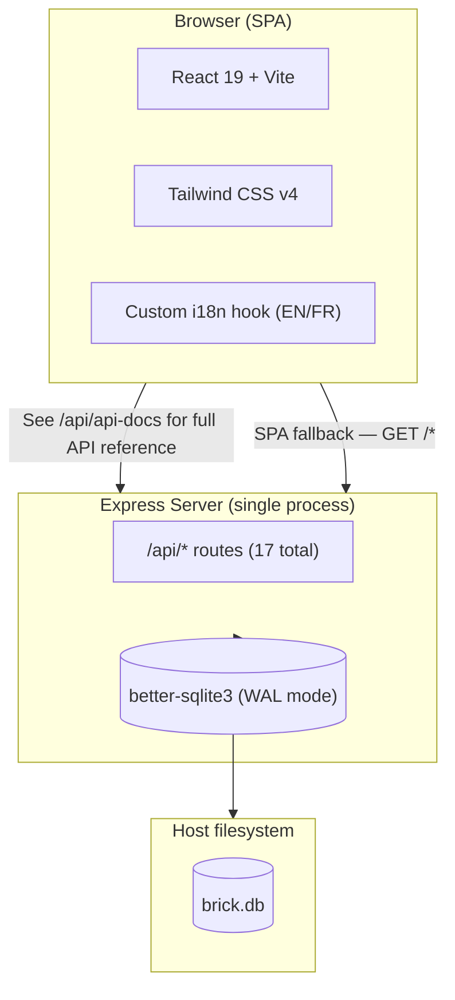
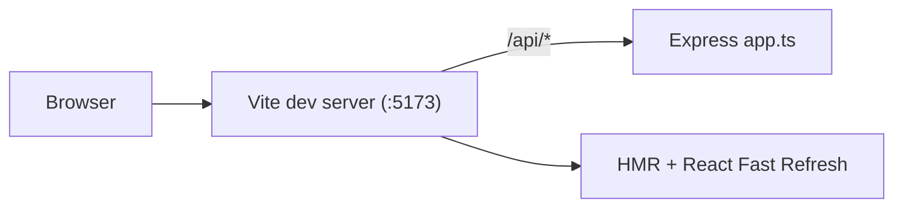
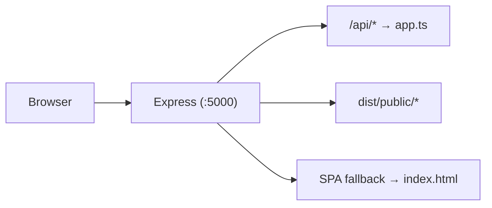
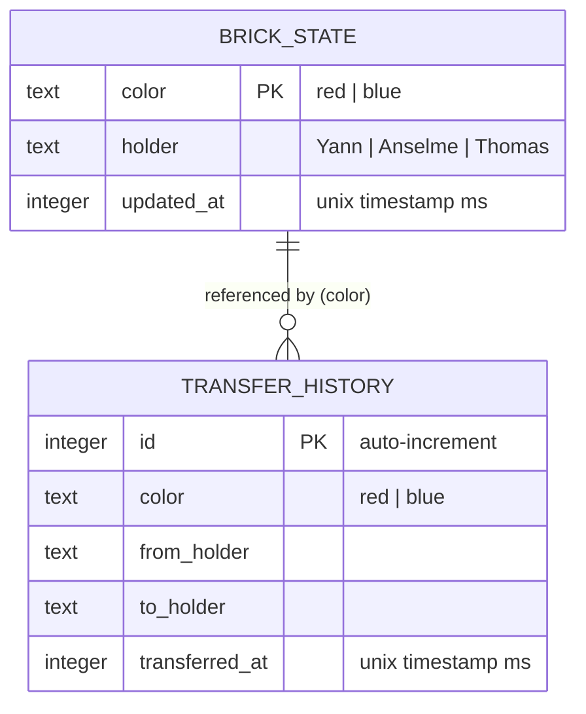

# Brick Master Tracker

A full-stack tracking app for two legendary Lego bricks — the **Brick of Honor** and the **Brick of Shame** — passed between three friends (Yann, Anselme, and Thomas). Each brick has a current holder, and every transfer is recorded in a public ledger. Dark-themed, with full English and French localization.

Built with React 19, Express 5, SQLite (better-sqlite3), and Tailwind CSS v4.

---

## Architecture Overview

A deliberately simple stack: Express serves both the SPA and the API from a single process, backed by SQLite (no ORM, no separate database server).



---

## Request Flow: Dev vs Production

**Development**: Vite's dev server mounts Express as middleware. React HMR on `:5173`.



**Production**: Express serves the SPA static assets and API from a single process on `:5000`.



---

## Directory Structure

```
.
├── Dockerfile                  # Multi-stage build (node:24-alpine)
├── compose.yaml                # Production app deployment
├── compose.preprod.yaml        # Preprod override (isolated instance, :5173)
├── obs/
│   ├── compose.yaml            # Standalone Grafana LGTM observability stack
│   └── .env.example            # Grafana admin credentials
├── pnpm-workspace.yaml         # onlyBuiltDependencies (better-sqlite3, esbuild)
├── tsconfig.json               # Strict TS config
├── vite.config.ts              # Vite + React + Tailwind + API dev middleware
├── build-server.mjs            # esbuild → dist/server.mjs (+ telemetry chunks)
├── index.html                  # HTML shell
├── .env.example                # PORT, DB_PATH, OIDC, telemetry vars
├── mise.toml                   # Dev tools + preprod tasks (preprod-up/down/logs)
│
├── shared/
│   └── constants.ts            # FRIENDS array — single source of truth
│
├── server/
│   ├── index.ts                # Production entry: Express + static + SPA fallback
│   ├── telemetry.ts            # OpenTelemetry SDK bootstrap (OTLP-gated)
│   ├── logger.ts               # pino structured logging (dev/prod/OTLP modes)
│   ├── app.ts                  # Express app: routes, validation, logging
│   └── db.ts                   # SQLite init, schema creation, idempotent seed
│
├── public/
│   ├── favicon.svg
│   ├── red-brick.png
│   └── blue-brick.png
│
└── src/
    ├── main.tsx                # React root mount
    ├── App.tsx                 # Root component
    ├── api.ts                  # Data-fetching hook + mutation (useBricks, useTransfers, transferBrick)
    ├── index.css               # Tailwind v4 + dark theme
    ├── lib/
    │   └── utils.ts            # cn() helper (clsx + twMerge)
    ├── hooks/
    │   ├── use-toast.ts        # Lightweight toast manager
    │   └── use-translation.ts  # i18n hook (EN/FR, localStorage)
    ├── locales/
    │   ├── en.ts
    │   └── fr.ts
    ├── components/
    │   └── ui/
    │       ├── button.tsx
    │       ├── card.tsx
    │       └── toaster.tsx
    └── pages/
        ├── home.tsx            # Main page: brick cards + transfer ledger
        └── not-found.tsx       # 404 page
```

---

## Database Schema

Two tables, created automatically on first run (no migration tooling needed).



Two rows are seeded automatically if the database is empty:

| color | holder (default) |
|-------|------------------|
| red   | Yann             |
| blue  | Thomas           |

`transfer_history` grows unbounded with every transfer.

---

## API Documentation

All API endpoints are documented via an OpenAPI 3.0 specification, served interactively through Swagger UI.

### Development

```bash
pnpm dev
# Open http://localhost:5173/api/api-docs
```


### Raw spec

The raw OpenAPI specification is available as JSON at `/api/api-docs.json`.

---

## Technology Stack

| Layer | Technology |
|-------|-----------|
| **Runtime** | Node.js 24 |
| **Language** | TypeScript (strict mode) |
| **Frontend** | React 19, Vite 7, Tailwind CSS 4 |
| **Backend** | Express 5 |
| **Database** | SQLite via better-sqlite3 (raw SQL, no ORM) |
| **Bundling** | Vite (SPA), esbuild (server) |
| **i18n** | Custom hook (EN, FR) |
| **Validation** | Manual input checks |
| **Logging** | pino (structured JSON; OTLP export to the observability stack) |
| **Observability** | OpenTelemetry (traces, metrics) + Grafana LGTM stack |
| **Container** | Docker multi-stage (Alpine) |
| **Dev env** | mise (node, pnpm, python) |

---

## Development

### Prerequisites

[mise](https://mise.jdx.dev/) manages Node.js, pnpm, Python, Neovim, opencode, and openspec.
Enable mise shims once (add to your shell rc):

```bash
mise activate bash   # or zsh/fish
mise install         # then, inside the project
```

Git plus a C compiler and make are expected from the system (only needed if
`better-sqlite3` has no prebuilt binary for your platform).

### Getting started

```bash
# Install dependencies (compiles better-sqlite3 native addon)
pnpm install

# Start dev server — Vite with HMR on http://localhost:5173
# The Express API is mounted as Vite middleware at /api/*
pnpm dev

# Type-check only (no emit)
pnpm typecheck

# Build for production (type-check → Vite SPA bundle → esbuild server bundle)
pnpm build

# Run production server on :5000
PORT=5000 pnpm start
```

### Testing with dev test users (no OIDC provider)

During development you can sign in without the OIDC provider. When dev login is enabled (the default outside production), the login page shows a **"Dev test users"** picker with three seeded accounts — **Yann**, **Anselme**, and **Thomas** — in addition to the normal "Sign in" button.

- Each picker button signs you in as that user via a real session, so you can test the full multi-user transfer flow (holders, recipient pickers, transfer authorization) by signing in as different users.
- On a freshly initialized database, the red brick is bootstrapped to **Yann** and the blue brick to **Thomas**, so transfers are testable immediately.
- Dev login is disabled automatically when `NODE_ENV=production`. To disable it explicitly in development, set `DEV_LOGIN=false` in your environment.

```bash
# Start the dev server, then open http://localhost:5173 and use the test-user picker
pnpm dev

# Or disable dev test-user login
DEV_LOGIN=false pnpm dev
```

### Before submitting a change

Run through this checklist every time you open a PR or push a commit:

1. **Type-check** — ensure no TypeScript errors:
   ```bash
   pnpm typecheck
   ```

2. **Build** — verify the production bundle compiles cleanly:
   ```bash
   pnpm build
   ```

3. **Dev smoke test** — start the dev server and manually test the change:
   ```bash
   pnpm dev
   ```

4. **Bump version** — update the `version` field in `package.json` (semver):
   - **patch** (`0.0.x`): bug fixes, small UI tweaks
   - **minor** (`0.x.0`): new features, new routes
   - **major** (`x.0.0`): breaking API or DB schema changes

### Working with the database

The database is created automatically on first request. No migration or seed commands needed:

- `server/db.ts` runs on every startup — it creates tables if missing and seeds defaults if the database is empty.
- The DB file defaults to `/app/data/brick.db`. Override with `DB_PATH`:
  ```bash
  DB_PATH=./data/brick.db pnpm dev
  ```

### Docker

```bash
# Build the image
docker build -t brick-tracker .

# Run with persistent database volume
docker run -v brick-data:/app/data -p 5000:5000 brick-tracker
```

The Dockerfile is a multi-stage build:
1. **Stage 1 (`build`)**: Install deps with `build-base` (for native compilation), run `pnpm build` (type-check + Vite + esbuild), prune devDependencies.
2. **Stage 2 (`production`)**: Copy built artifacts and runtime deps. Run as non-root `node` user. Mount a volume at `/app/data` to persist `brick.db`.

---

## Deployment: production, preprod, and observability

Three compose entry points share two Docker networks (`caddy_public` for anything behind the reverse proxy, `telemetry` for the observability backend):

| Environment | Command | App URL | Data |
|-------------|---------|---------|------|
| **Production** | `docker compose up -d --build` | `:5000` (via Caddy) | bind mount `./brick-tracker-data` |
| **Preprod** | `mise run preprod-up` | `https://brique-dev.patates.club` (`:5173`) | isolated volume `brick-tracker-preprod-data` |
| **Observability** | `cd obs && docker compose up -d` | Grafana UI via Caddy (`lgtm:3000`) | volume `obs_lgtm-data` |

Start the observability stack first — it creates the `telemetry` network every app instance joins.

### Observability (one LGTM instance for the whole host)

The stack lives in `obs/compose.yaml`: a single `grafana/otel-lgtm` container (embedded OTel collector + Prometheus + Loki + Tempo + Grafana). Every app instance — production container, preprod container, host-run dev server — exports traces, metrics, and logs to it and distinguishes itself by resource attributes:

- `OTEL_SERVICE_NAME=brick-tracker` (stable across environments)
- `OTEL_RESOURCE_ATTRIBUTES=deployment.environment.name=production|preprod|development`

In Grafana, filter or group by `deployment.environment.name`. Host-run dev instances use the loopback-published collector (`OTEL_EXPORTER_OTLP_ENDPOINT=http://127.0.0.1:4318`); telemetry activates only when that endpoint is set. Collector ports are never exposed beyond loopback or routed through Caddy.

### Preprod workflow

Preprod is an isolated second instance of the same image for testing, running alongside production with **no observability of its own** — it ships telemetry to the shared LGTM tagged `deployment.environment.name=preprod`.

```bash
# Start (builds if needed) — production keeps running untouched
mise run preprod-up

# Follow logs / stop
mise run preprod-logs
mise run preprod-down        # keeps the preprod data volume
```

Characteristics (see `compose.preprod.yaml`):

- Own container (`brick-tracker-preprod`) and data volume — test traffic never touches production data
- Port `5173` (the dev-mode port); production stays on `5000`
- `APP_URL=https://brique-dev.patates.club`, so OIDC redirects target the preprod domain

Prerequisites for the login round-trip:

1. The observability stack is up (`cd obs && docker compose up -d`).
2. Pocket-ID's OIDC client allows the redirect URI `https://brique-dev.patates.club/api/auth/callback`.
3. A Caddy route:
   ```
   brique-dev.patates.club {
       reverse_proxy brick-tracker-preprod:5173
   }
   ```

Full reset of the preprod environment:

```bash
docker compose -p brick-preprod -f compose.yaml -f compose.preprod.yaml down -v
```
