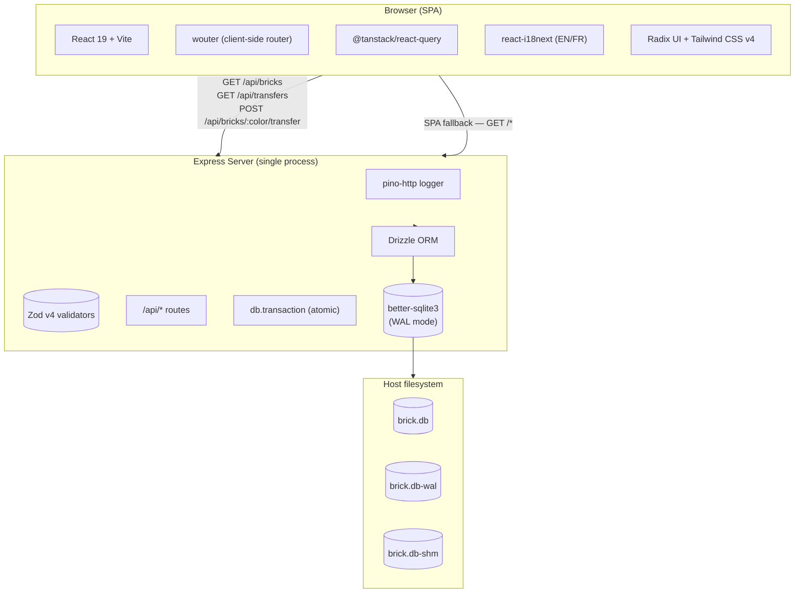
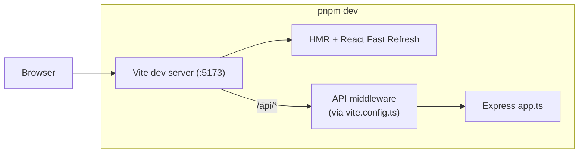
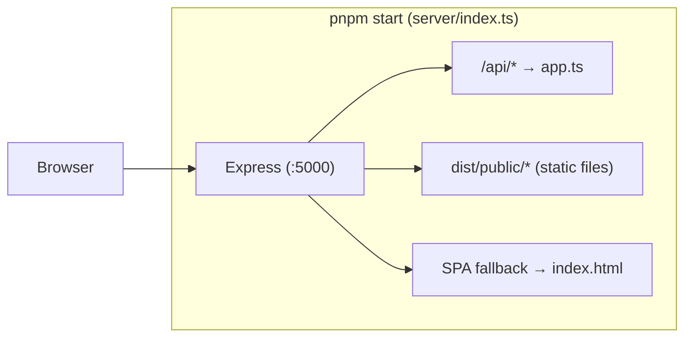
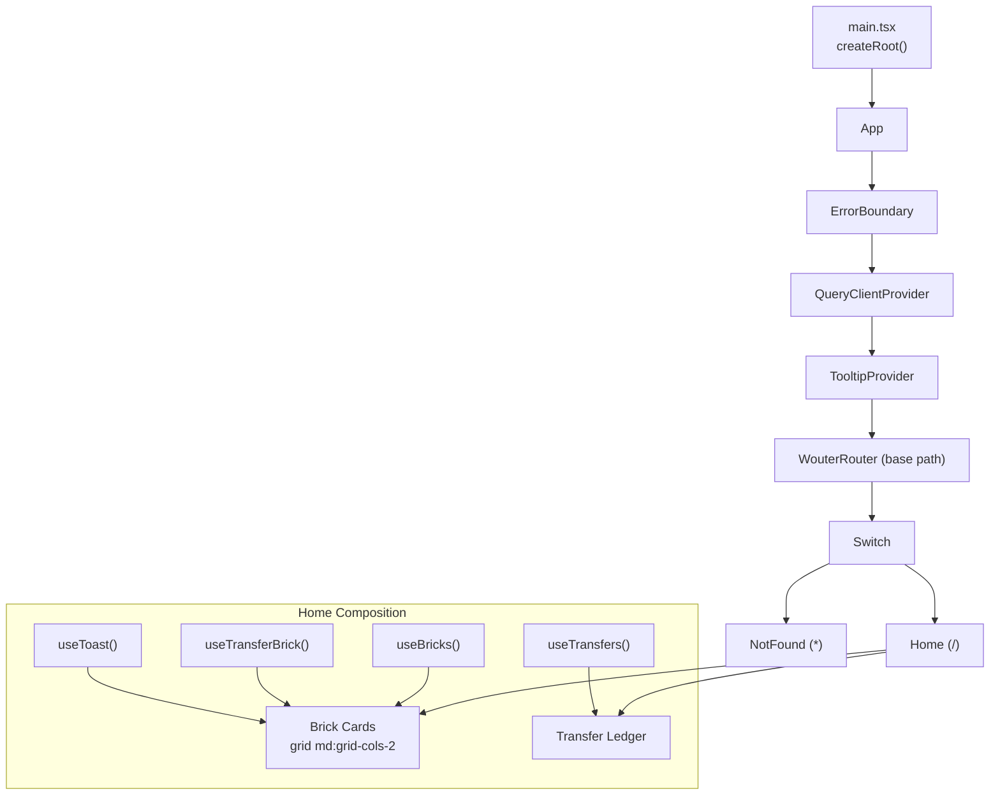
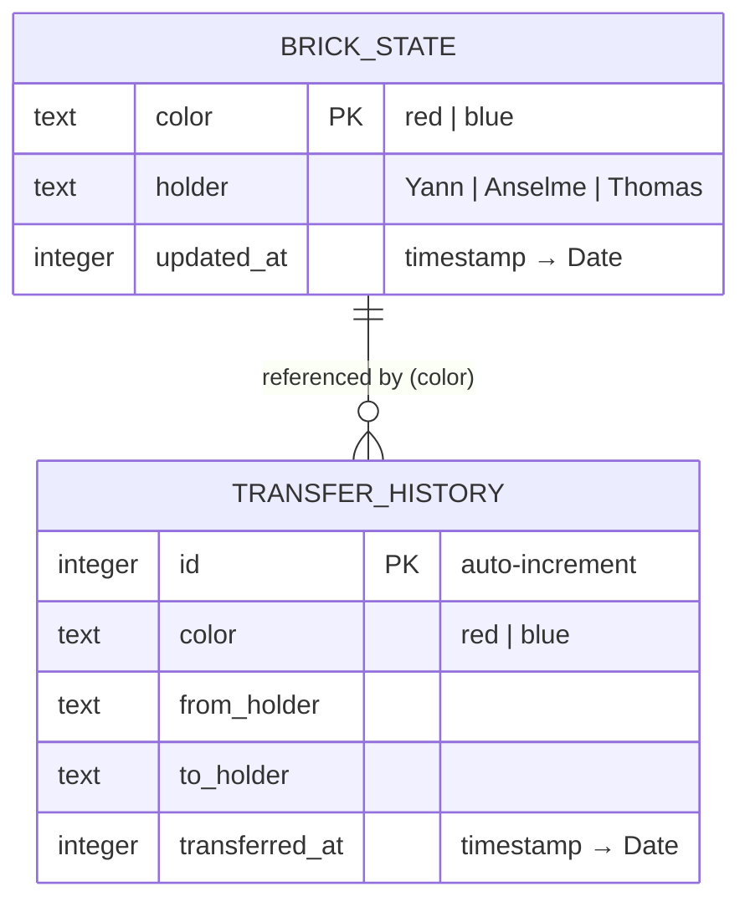
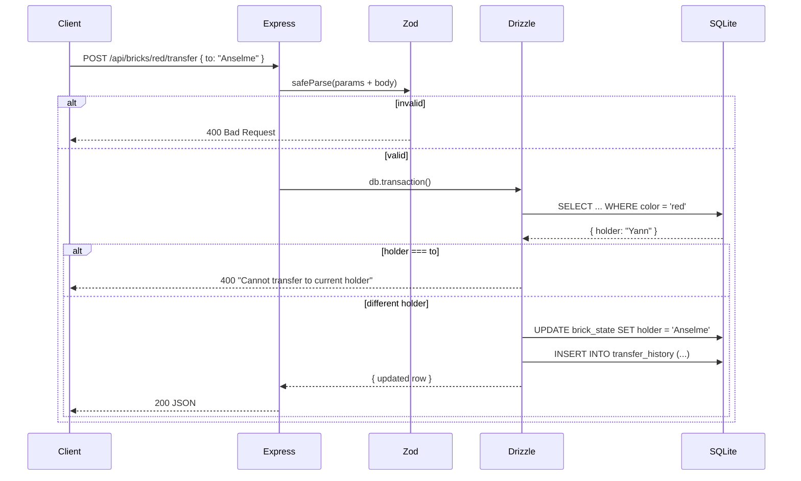
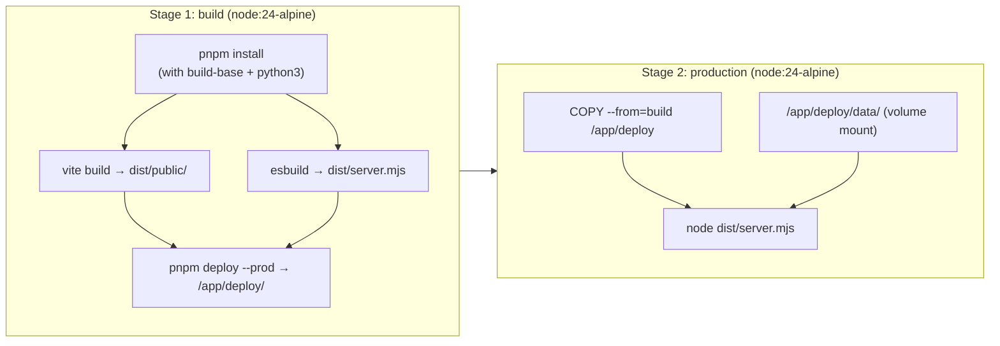

# Brick Master Tracker

A full-stack tracking app for two legendary Lego bricks — the **Brick of Honor** and the **Brick of Shame** — passed between friends.

Built with React, Express, SQLite, and Tailwind CSS. Fully containerised, dark-themed, i18n-ready (EN/FR).

---

## Architecture Overview



---

## Request Flow: Dev vs Production

In **development**, Vite's dev server mounts the Express API as middleware:



In **production**, a single Express process serves both the SPA and API:



---

## Directory Structure

```
.
├── Dockerfile                           # Multi-stage build (node:24-alpine)
├── pnpm-workspace.yaml                  # Workspace root, catalog, onlyBuiltDependencies
├── tsconfig.base.json                   # Shared strict TS config
├── tsconfig.json                        # Project references → artifacts/brick-tracker
├── .env.example                         # PORT, DB_PATH
├── shell.nix                            # Nix dev shell (node 22, pnpm, git)
│
└── artifacts/brick-tracker/
    ├── package.json                     # @workspace/brick-tracker
    ├── tsconfig.json                    # includes src/, server/, shared/
    ├── vite.config.ts                   # Vite + API dev plugin + @ alias + SSR externals
    ├── build-server.mjs                 # esbuild bundle → dist/server.mjs
    ├── drizzle.config.ts                # drizzle-kit push (SQLite)
    ├── index.html                       # HTML shell
    │
    ├── shared/
    │   └── constants.ts                 # FRIENDS array — single source of truth
    │
    ├── server/
    │   ├── index.ts                     # Production entry: Express + static + SPA fallback
    │   ├── app.ts                       # Express app: pino-http + JSON + router mount
    │   ├── logger.ts                    # pino (pino-pretty in dev)
    │   ├── validation.ts                # Zod schemas (imports FRIENDS from shared/)
    │   ├── routes/
    │   │   ├── index.ts                 # Aggregates health + bricks routers
    │   │   ├── health.ts                # GET /healthz
    │   │   └── bricks.ts                # GET /bricks, POST /bricks/:color/transfer, GET /transfers
    │   └── db/
    │       ├── client.ts                # better-sqlite3 + Drizzle init (WAL pragma)
    │       ├── schema.ts                # brick_state + transfer_history tables
    │       └── seed.ts                  # Idempotent seed script
    │
    └── src/
        ├── main.tsx                     # React root mount
        ├── App.tsx                      # ErrorBoundary → QueryClient → Tooltip → Router
        ├── i18n.ts                      # i18next init (EN/FR, localStorage)
        ├── index.css                    # Tailwind v4 + custom dark theme + font faces
        ├── api/
        │   ├── types.ts                 # BrickState, Transfer, TransferInput
        │   ├── fetch.ts                 # Shared fetchJson helper
        │   ├── queries.ts              # useBricks, useTransfers (react-query)
        │   └── mutations.ts            # useTransferBrick (react-query)
        ├── components/
        │   ├── ErrorBoundary.tsx        # Class-based React error boundary
        │   └── ui/                      # shadcn-style primitives
        │       ├── button.tsx
        │       ├── card.tsx
        │       ├── toast.tsx
        │       ├── toaster.tsx
        │       └── tooltip.tsx
        ├── hooks/
        │   └── use-toast.ts            # Toast state manager (reducer pattern)
        ├── lib/
        │   └── utils.ts                # cn() helper (clsx + twMerge)
        ├── locales/
        │   ├── en.ts
        │   └── fr.ts
        └── pages/
            ├── home.tsx                # Main page: brick cards + transfer ledger
            └── not-found.tsx           # 404 page (dark themed, i18n)
```

---

## Component Tree



---

## Database Schema



There are exactly **two rows** in `brick_state` — seeded idempotently via `pnpm db:seed`:

| color | holder (default) |
|-------|-----------------|
| red   | Yann            |
| blue  | Thomas          |

`transfer_history` grows unbounded with every transfer.

---

## API Routes

| Method | Path | Body | Response | Notes |
|--------|------|------|----------|-------|
| `GET` | `/api/healthz` | — | `{ status: "ok" }` | Past-proven by Zod |
| `GET` | `/api/bricks` | — | `BrickState[]` | Current holder for each colour |
| `GET` | `/api/transfers` | — | `Transfer[]` | Descending by `transferredAt` |
| `POST` | `/api/bricks/:color/transfer` | `{ to: "Yann" \| "Anselme" \| "Thomas" }` | `BrickState` | Atomic transaction |

### Transfer endpoint flow



---

## Docker Build Pipeline



Key details:
- **Multi-stage build** keeps the final image lean (no build tools).
- **`pnpm deploy --prod`** produces a self-contained directory with only runtime dependencies.
- **Non-root user** (`appuser:appgroup`, uid 1001) for security.
- **Volume mount** at `/app/deploy/data` persists the SQLite database across container restarts.

---

## Technology Stack

| Layer | Technology |
|-------|-----------|
| **Runtime** | Node.js 24 |
| **Language** | TypeScript 5.9 (strict mode) |
| **Frontend** | React 19, Vite 7, Tailwind CSS 4, Radix UI, wouter, @tanstack/react-query |
| **Backend** | Express 5, pino (structured logging) |
| **Database** | SQLite via better-sqlite3, Drizzle ORM |
| **Validation** | Zod v4 |
| **Bundling** | Vite (SPA), esbuild (server) |
| **i18n** | i18next + react-i18next (EN, FR) |
| **Container** | Docker multi-stage (Alpine) |
| **Dev env** | Nix shell (node, pnpm, git) |

---

## Development

```bash
# Install dependencies
pnpm install

# Start dev server (Vite + Express API on :5173)
pnpm dev

# Type-check only
pnpm typecheck

# Build for production
pnpm build

# Run production server
pnpm start

# Push database schema
pnpm db:push

# Seed initial data (idempotent)
pnpm --filter @workspace/brick-tracker db:seed
```

### Docker

```bash
docker build -t brick-tracker .
docker run -v brick-data:/app/deploy/data -p 5000:5000 brick-tracker
```