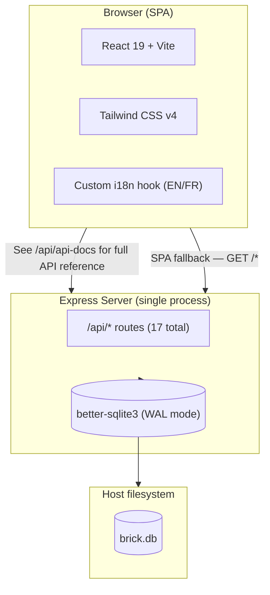
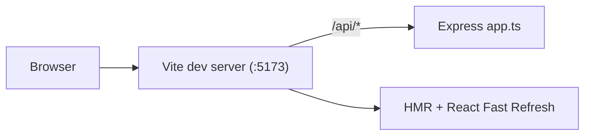
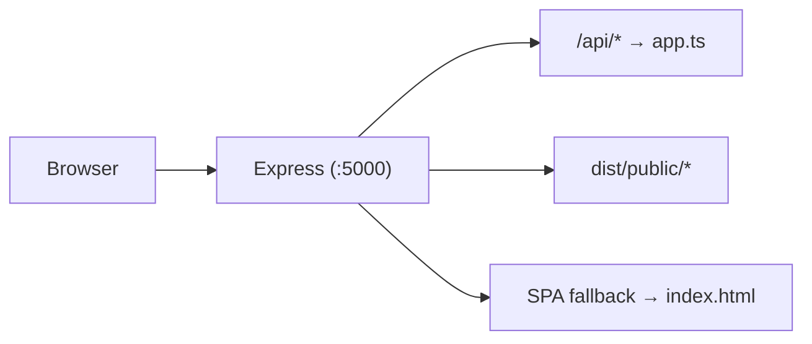
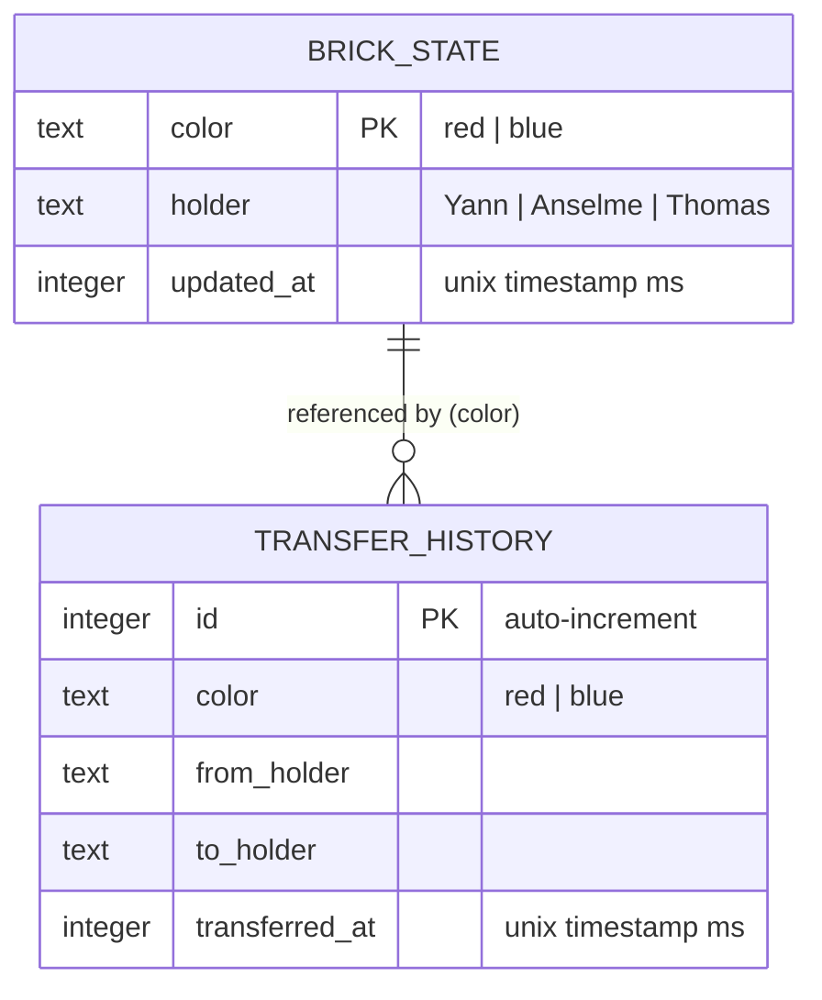

# Brick Master Tracker

A full-stack tracking app for two legendary Lego bricks — the **Brick of Honor** and the **Brick of Shame** — passed between three friends (Yann, Anselme, and Thomas). Each brick has a current holder, and every transfer is recorded in a public ledger. Dark-themed, with full English and French localization.

Built with React 19, Express 5, SQLite (better-sqlite3), and Tailwind CSS v4.

---

## Architecture Overview

A deliberately simple stack: Express serves both the SPA and the API from a single process, backed by SQLite (no ORM, no separate database server).



---

## Request Flow: Dev vs Production

**Development**: Vite's dev server mounts Express as middleware. React HMR on `:5173`.



**Production**: Express serves the SPA static assets and API from a single process on `:5000`.



---

## Directory Structure

```
.
├── Dockerfile                  # Multi-stage build (node:24-alpine)
├── pnpm-workspace.yaml         # onlyBuiltDependencies (better-sqlite3, esbuild)
├── tsconfig.json               # Strict TS config
├── vite.config.ts              # Vite + React + Tailwind + API dev middleware
├── build-server.mjs            # esbuild → dist/server.mjs
├── index.html                  # HTML shell
├── .env.example                # PORT, DB_PATH
├── shell.nix                   # Nix dev shell (node, pnpm, gcc, make)
│
├── shared/
│   └── constants.ts            # FRIENDS array — single source of truth
│
├── server/
│   ├── index.ts                # Production entry: Express + static + SPA fallback
│   ├── app.ts                  # Express app: routes, validation, logging
│   └── db.ts                   # SQLite init, schema creation, idempotent seed
│
├── public/
│   ├── favicon.svg
│   ├── red-brick.png
│   └── blue-brick.png
│
└── src/
    ├── main.tsx                # React root mount
    ├── App.tsx                 # Root component
    ├── api.ts                  # Data-fetching hook + mutation (useBricks, useTransfers, transferBrick)
    ├── index.css               # Tailwind v4 + dark theme
    ├── lib/
    │   └── utils.ts            # cn() helper (clsx + twMerge)
    ├── hooks/
    │   ├── use-toast.ts        # Lightweight toast manager
    │   └── use-translation.ts  # i18n hook (EN/FR, localStorage)
    ├── locales/
    │   ├── en.ts
    │   └── fr.ts
    ├── components/
    │   └── ui/
    │       ├── button.tsx
    │       ├── card.tsx
    │       └── toaster.tsx
    └── pages/
        ├── home.tsx            # Main page: brick cards + transfer ledger
        └── not-found.tsx       # 404 page
```

---

## Database Schema

Two tables, created automatically on first run (no migration tooling needed).



Two rows are seeded automatically if the database is empty:

| color | holder (default) |
|-------|------------------|
| red   | Yann             |
| blue  | Thomas           |

`transfer_history` grows unbounded with every transfer.

---

## API Documentation

All API endpoints are documented via an OpenAPI 3.0 specification, served interactively through Swagger UI.

### Development

```bash
pnpm dev
# Open http://localhost:5173/api/api-docs
```

### Production

```bash
pnpm build && pnpm start
# Open http://localhost:5000/api/api-docs
```

### Raw spec

The raw OpenAPI specification is available as JSON at `/api/api-docs.json`.

---

## Technology Stack

| Layer | Technology |
|-------|-----------|
| **Runtime** | Node.js 24 |
| **Language** | TypeScript (strict mode) |
| **Frontend** | React 19, Vite 7, Tailwind CSS 4 |
| **Backend** | Express 5 |
| **Database** | SQLite via better-sqlite3 (raw SQL, no ORM) |
| **Bundling** | Vite (SPA), esbuild (server) |
| **i18n** | Custom hook (EN, FR) |
| **Validation** | Manual input checks |
| **Logging** | `console.log` |
| **Container** | Docker multi-stage (Alpine) |
| **Dev env** | Nix shell (node, pnpm, gcc) |

---

## Development

### Prerequisites

**Option A — Nix (recommended):**
```bash
nix-shell shell.nix
```

**Option B — Manual:**
- Node.js 22+
- pnpm 9+
- C compiler + make (for better-sqlite3 native addon)

### Getting started

```bash
# Install dependencies (compiles better-sqlite3 native addon)
pnpm install

# Start dev server — Vite with HMR on http://localhost:5173
# The Express API is mounted as Vite middleware at /api/*
pnpm dev

# Type-check only (no emit)
pnpm typecheck

# Build for production (type-check → Vite SPA bundle → esbuild server bundle)
pnpm build

# Run production server on :5000
PORT=5000 pnpm start
```

### Testing with dev test users (no OIDC provider)

During development you can sign in without the OIDC provider. When dev login is enabled (the default outside production), the login page shows a **"Dev test users"** picker with three seeded accounts — **Yann**, **Anselme**, and **Thomas** — in addition to the normal "Sign in" button.

- Each picker button signs you in as that user via a real session, so you can test the full multi-user transfer flow (holders, recipient pickers, transfer authorization) by signing in as different users.
- On a freshly initialized database, the red brick is bootstrapped to **Yann** and the blue brick to **Thomas**, so transfers are testable immediately.
- Dev login is disabled automatically when `NODE_ENV=production`. To disable it explicitly in development, set `DEV_LOGIN=false` in your environment.

```bash
# Start the dev server, then open http://localhost:5173 and use the test-user picker
pnpm dev

# Or disable dev test-user login
DEV_LOGIN=false pnpm dev
```

### Before submitting a change

Run through this checklist every time you open a PR or push a commit:

1. **Type-check** — ensure no TypeScript errors:
   ```bash
   pnpm typecheck
   ```

2. **Build** — verify the production bundle compiles cleanly:
   ```bash
   pnpm build
   ```

3. **Dev smoke test** — start the dev server and manually test the change:
   ```bash
   pnpm dev
   ```

4. **Bump version** — update the `version` field in `package.json` (semver):
   - **patch** (`0.0.x`): bug fixes, small UI tweaks
   - **minor** (`0.x.0`): new features, new routes
   - **major** (`x.0.0`): breaking API or DB schema changes

### Working with the database

The database is created automatically on first request. No migration or seed commands needed:

- `server/db.ts` runs on every startup — it creates tables if missing and seeds defaults if the database is empty.
- The DB file defaults to `/app/data/brick.db`. Override with `DB_PATH`:
  ```bash
  DB_PATH=./data/brick.db pnpm dev
  ```

### Docker

```bash
# Build the image
docker build -t brick-tracker .

# Run with persistent database volume
docker run -v brick-data:/app/data -p 5000:5000 brick-tracker
```

The Dockerfile is a multi-stage build:
1. **Stage 1 (`build`)**: Install deps with `build-base` (for native compilation), run `pnpm build` (type-check + Vite + esbuild), prune devDependencies.
2. **Stage 2 (`production`)**: Copy built artifacts and runtime deps. Run as non-root `appuser` (uid 1001). Mount a volume at `/app/data` to persist `brick.db`.
