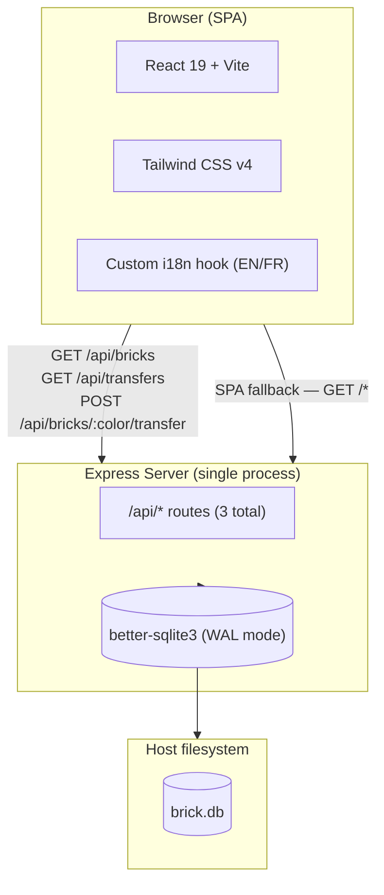
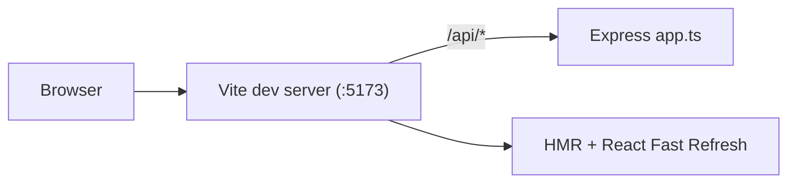
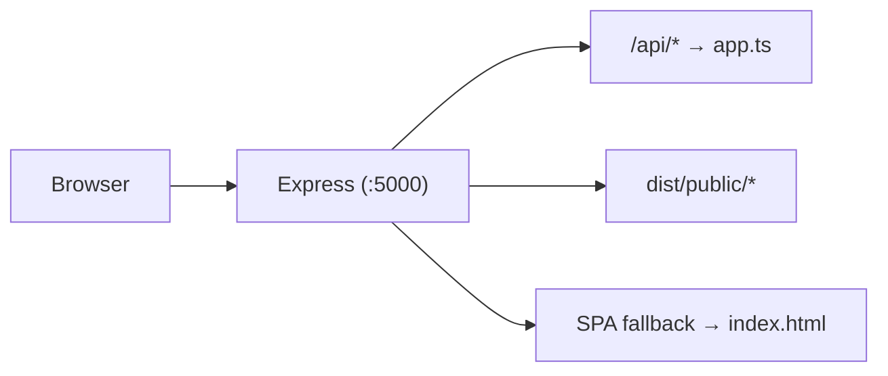
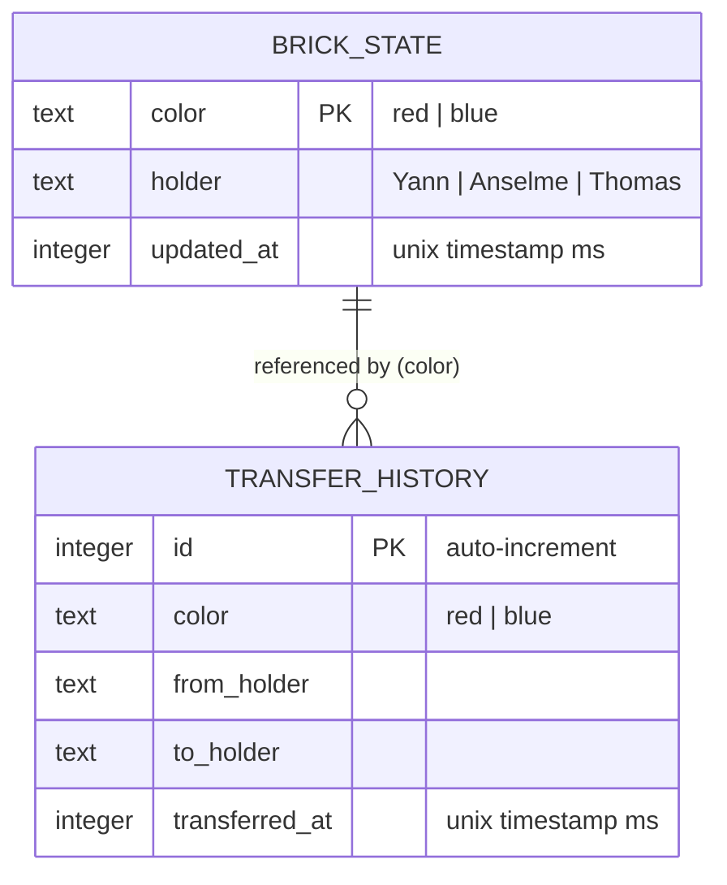
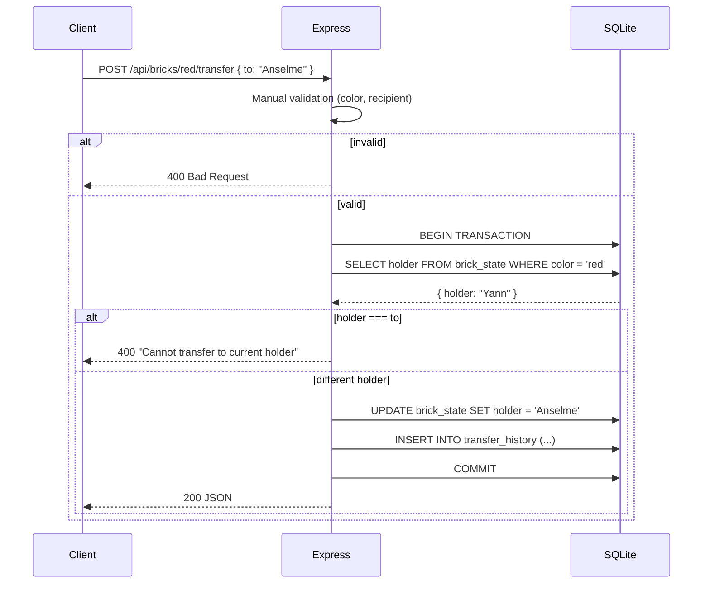

# Brick Master Tracker

A full-stack tracking app for two legendary Lego bricks — the **Brick of Honor** and the **Brick of Shame** — passed between friends.

Built with React, Express, SQLite, and Tailwind CSS. Dark-themed, i18n-ready (EN/FR).

---

## Architecture Overview

A deliberately simple stack: Express serves both the SPA and the API from a single process, backed by SQLite (no ORM, no separate database server).



---

## Request Flow: Dev vs Production

**Development**: Vite's dev server mounts Express as middleware. React HMR on `:5173`.



**Production**: Express serves the SPA static assets and API from a single process on `:5000`.



---

## Directory Structure

```
.
├── Dockerfile                  # Multi-stage build (node:24-alpine)
├── pnpm-workspace.yaml         # onlyBuiltDependencies (better-sqlite3, esbuild)
├── tsconfig.json               # Strict TS config
├── vite.config.ts              # Vite + React + Tailwind + API dev middleware
├── build-server.mjs            # esbuild → dist/server.mjs
├── index.html                  # HTML shell
├── .env.example                # PORT, DB_PATH
├── shell.nix                   # Nix dev shell (node, pnpm, gcc, make)
│
├── shared/
│   └── constants.ts            # FRIENDS array — single source of truth
│
├── server/
│   ├── index.ts                # Production entry: Express + static + SPA fallback
│   ├── app.ts                  # Express app: routes, validation, logging
│   └── db.ts                   # SQLite init, schema creation, idempotent seed
│
├── public/
│   ├── favicon.svg
│   ├── red-brick.png
│   └── blue-brick.png
│
└── src/
    ├── main.tsx                # React root mount
    ├── App.tsx                 # Root component
    ├── api.ts                  # Data-fetching hook + mutation (useBricks, useTransfers, transferBrick)
    ├── index.css               # Tailwind v4 + dark theme
    ├── lib/
    │   └── utils.ts            # cn() helper (clsx + twMerge)
    ├── hooks/
    │   ├── use-toast.ts        # Lightweight toast manager
    │   └── use-translation.ts  # i18n hook (EN/FR, localStorage)
    ├── locales/
    │   ├── en.ts
    │   └── fr.ts
    ├── components/
    │   └── ui/
    │       ├── button.tsx
    │       ├── card.tsx
    │       └── toaster.tsx
    └── pages/
        ├── home.tsx            # Main page: brick cards + transfer ledger
        └── not-found.tsx       # 404 page
```

---

## Database Schema

Two tables, created automatically on first run (no migration tooling needed).



Two rows are seeded automatically if the database is empty:

| color | holder (default) |
|-------|------------------|
| red   | Yann             |
| blue  | Thomas           |

`transfer_history` grows unbounded with every transfer.

---

## API Routes

| Method | Path | Body | Response | Notes |
|--------|------|------|----------|-------|
| `GET` | `/api/healthz` | — | `{ status: "ok" }` | Health check |
| `GET` | `/api/bricks` | — | `BrickState[]` | Current holder for each color |
| `GET` | `/api/transfers` | — | `Transfer[]` | Descending by `transferredAt` |
| `POST` | `/api/bricks/:color/transfer` | `{ to: "Yann" \| "Anselme" \| "Thomas" }` | `BrickState` | Atomic SQLite transaction |

### Transfer flow



---

## Technology Stack

| Layer | Technology |
|-------|-----------|
| **Runtime** | Node.js 24 |
| **Language** | TypeScript (strict mode) |
| **Frontend** | React 19, Vite 7, Tailwind CSS 4 |
| **Backend** | Express 5 |
| **Database** | SQLite via better-sqlite3 (raw SQL, no ORM) |
| **Bundling** | Vite (SPA), esbuild (server) |
| **i18n** | Custom hook (EN, FR) |
| **Validation** | Manual input checks |
| **Logging** | `console.log` |
| **Container** | Docker multi-stage (Alpine) |
| **Dev env** | Nix shell (node, pnpm, gcc) |

---

## Development

### Prerequisites

**Option A — Nix (recommended):**
```bash
nix-shell shell.nix
```

**Option B — Manual:**
- Node.js 22+
- pnpm 9+
- C compiler + make (for better-sqlite3 native addon)

### Getting started

```bash
# Install dependencies (compiles better-sqlite3 native addon)
pnpm install

# Start dev server — Vite with HMR on http://localhost:5173
# The Express API is mounted as Vite middleware at /api/*
pnpm dev

# Type-check only (no emit)
pnpm typecheck

# Build for production (type-check → Vite SPA bundle → esbuild server bundle)
pnpm build

# Run production server on :5000
PORT=5000 pnpm start
```

### Working with the database

The database is created automatically on first request. No migration or seed commands needed:

- `server/db.ts` runs on every startup — it creates tables if missing and seeds defaults if the database is empty.
- The DB file defaults to `./brick.db`. Override with `DB_PATH`:
  ```bash
  DB_PATH=./data/brick.db pnpm dev
  ```

### Docker

```bash
# Build the image
docker build -t brick-tracker .

# Run with persistent database volume
docker run -v brick-data:/app/data -p 5000:5000 brick-tracker
```

The Dockerfile is a multi-stage build:
1. **Stage 1 (`build`)**: Install deps with `build-base` (for native compilation), run `pnpm build` (type-check + Vite + esbuild), prune devDependencies.
2. **Stage 2 (`production`)**: Copy built artifacts and runtime deps. Run as non-root `appuser` (uid 1001). Mount a volume at `/app/data` to persist `brick.db`.
